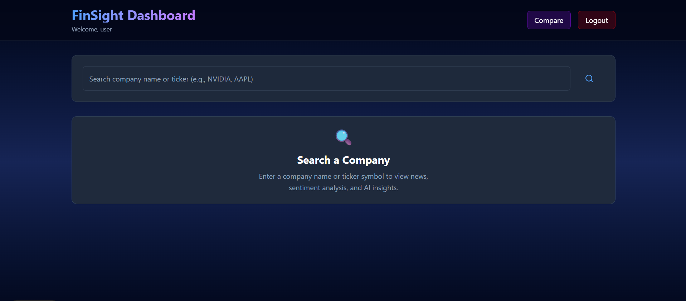
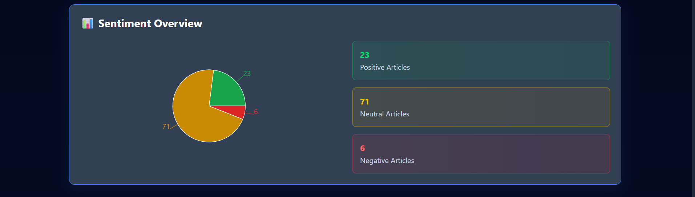
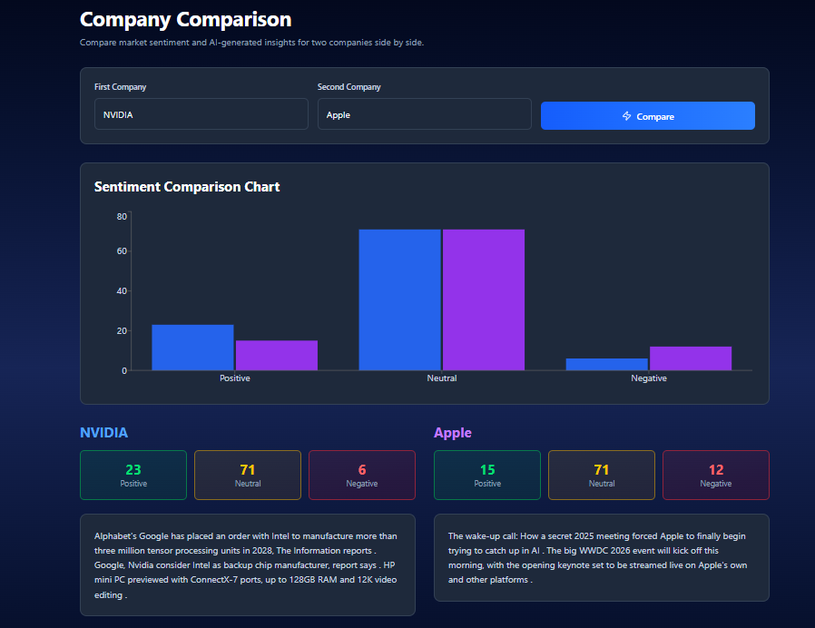
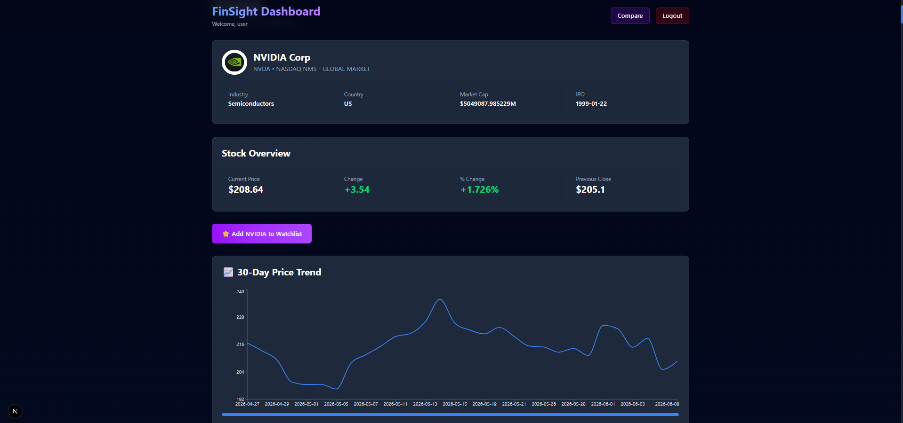

# FinSight — AI-Powered Financial Research Platform

FinSight is a full-stack financial research platform that helps users analyze companies through real-time market news, AI-powered sentiment analysis, stock market data, and automated financial insights.

The platform aggregates financial news, evaluates market sentiment using FinBERT, generates concise AI summaries, visualizes sentiment trends, and provides stock market information through an interactive dashboard.

---

## Features

### Authentication & Security

- User Registration & Login
- JWT-Based Authentication
- Protected Dashboard Routes

### Financial News Research

- Search companies such as Apple, Microsoft, NVIDIA, Tesla, Amazon, etc.
- Real-time financial news aggregation
- AI-generated financial news summaries

### AI & Machine Learning

- FinBERT-based financial sentiment analysis
- Automatic classification of news articles into:
  - Positive
  - Neutral
  - Negative
- Confidence scoring for sentiment predictions
- AI-powered company news summarization

### Market Analytics

- Sentiment distribution dashboard
- Interactive sentiment pie charts
- Company comparison dashboard
- Multi-company sentiment analysis

### Stock Market Data

- Real-time stock quote information
- Current stock price
- Daily price change
- Percentage change
- Previous close price
- Company profile information
- Market capitalization
- Industry and exchange details
- Historical stock price visualization

### Watchlist Management

- Add companies to watchlist
- Remove companies from watchlist
- One-click company research from watchlist

---

## Technology Stack

### Frontend

- Next.js
- React
- Tailwind CSS
- Recharts
- Axios

### Backend

- Node.js
- Express.js
- JWT Authentication
- REST APIs

### Machine Learning Service

- Python
- FastAPI
- Hugging Face Transformers
- FinBERT
- DistilBART Summarization

### Database

- MongoDB Atlas

### External APIs

- NewsAPI
- Finnhub
- Alpha Vantage

---

## System Architecture

```text
Next.js Frontend
        │
        ▼
Express.js Backend
        │
 ┌──────┴──────┐
 │             │
 ▼             ▼
MongoDB     FastAPI ML Service
                │
        ┌───────┴────────┐
        ▼                ▼
     FinBERT       AI Summarizer
```

---

## Project Highlights

- Built a full-stack financial research platform using Next.js, Express.js, MongoDB, and FastAPI.
- Integrated FinBERT-based NLP models for financial news sentiment analysis.
- Developed AI-powered financial news summarization and market intelligence features.
- Implemented real-time stock market analytics with company profile and historical price data.
- Designed a microservice architecture connecting a Node.js backend with a Python machine learning service.
- Created interactive sentiment dashboards and company comparison analytics.

---

## Screenshots

### Dashboard



### Sentiment Analytics



### Company Comparison



### Watchlist


### Stock Market Analytics



---

## Installation

### Clone Repository

```bash
git clone <https://github.com/Shivam-Agarwal-2006/FinSight>
cd FinSight
```

### Frontend

```bash
cd client
npm install
npm run dev
```

### Backend

```bash
cd server
npm install
npm run dev
```

### ML Service

```bash
cd ml-service

python -m venv venv

# Windows
venv\Scripts\activate

pip install -r requirements.txt

uvicorn main:app --reload
```

---

## Environment Variables

### Backend (.env)

```env
PORT=5000
MONGO_URI=your_mongodb_uri
JWT_SECRET=your_jwt_secret
NEWS_API_KEY=your_newsapi_key
FINNHUB_API_KEY=your_finnhub_key
ALPHA_VANTAGE_API_KEY=your_alpha_vantage_key
```

### ML Service

No additional environment variables required.

---

## Future Enhancements

- Portfolio Tracking
- Sentiment History Tracking
- Real-Time Market Alerts
- Advanced Company Comparison
- Financial Recommendation Engine

---

## License

This project is developed for educational and portfolio purposes.